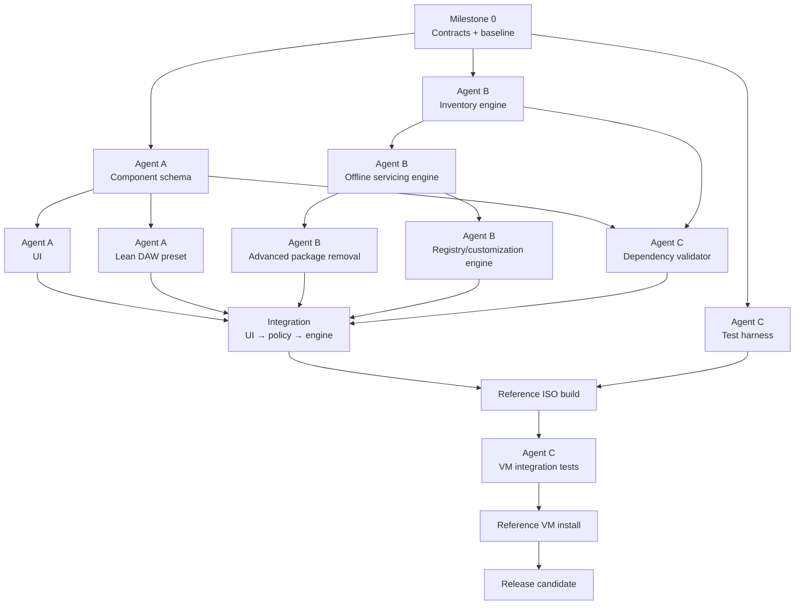

# Win11 Creator Deep Customization Fork — Implementation Plan

> **Execution rule:** A checkbox represents working capability, not the production of a certificate. Close it only when the implementation and its relevant automated test or manual acceptance check pass. The `Proof required` / `Proof` lines below define acceptance observables; reuse ordinary test, build, DISM, and VM output at its source instead of pasting duplicate evidence under every checkbox. Keep durable evidence only for the release candidate and for behavior that cannot be reproduced cheaply.

> **Coordination rule:** Land vertical slices of code and tests. Do not create a second tracker, readiness matrix, status dashboard, per-task report, or parent-level proof packet. The release gate references the detailed acceptance sections instead of duplicating them.

> **Safety rule:** Unknown Windows components default to **KEEP**. Removal requires either a known rule with rationale or an explicit Expert-mode user selection.

> **Source rule:** WinUtil is the implementation base. SlimDown11 is a behavioral/reference corpus for understanding possible Windows servicing operations. Do not transplant SlimDown code unless its licensing explicitly permits it; reimplement desired behavior using Microsoft-supported DISM/PowerShell mechanisms wherever possible.

> **Process boundary:** Planning, branch management, reviews, and reports earn no completion credit. Add a process artifact only when it has a named consumer, blocks a named capability from shipping, addresses an observed defect, and has a retirement condition. Negative constraints are guardrails, not closable deliverables.

## Implementation record

This compact record is the project owner's requested source for progress, decisions, rationale, lessons, and verification gaps. Update it when a change affects implementation direction or closes a plan item; do not duplicate ordinary commit history or test output here.

**Current status:** Active — the policy-driven Analyze-to-Build path, typed offline/setup actions, two-mode UAC choice, source-format preparation, and atomic one-mount transaction are integrated; live Windows execution and component-specific installed-state proof remain in progress.

**Pinned baseline**

* Upstream: `https://github.com/ChrisTitusTech/winutil.git`
* Upstream revision: `0dbe39bc7df41ef7d0cef74426f26c53089a8557` (`main`, observed 2026-08-15)
* Local integration branch: `feature/win11creator-deep-customization`

**Decisions and rationale**

* Use isolated Git worktrees for parallel agents, then integrate reviewed commits onto the feature branch. This preserves granular commits without sharing a mutable Git index.
* Keep `winutil.ps1` generated-only, as required by upstream `AGENTS.md` and `SPEC.md`; change modular sources and compile for verification.
* Treat `gpt-5.6-sol` with low reasoning as the available equivalent of the requested `5.6-sol-light` worker configuration.
* Do not mark Windows servicing, WPF, ISO, USB, VM, DAW, or developer gates complete from Linux-only evidence.
* The safety evaluator blocks `forbidden-unless-expert` conflicts, while warnings and likely-breakage remain visible but nonblocking. Expert mode changes permission, not evidence: conflicts remain in the result.
* Represent `ImageInventory` and resolved plans as versioned plain PowerShell objects because WinUtil compiles source files into one script rather than loading runtime modules/classes.
* Keep inventory collection injectable for unit tests, but require a live mounted 25H2 inventory before closing discovery tasks. Fixture success is not live servicing proof.
* Keep editable policy source under `policy/` and embed it into the compiled single-script runtime; `policy/` is the source of truth, while `$sync.configs.componentPolicy` is the filesystem-independent runtime representation.
* The initial Lean DAW consumer AppX set is Bing News, Bing Weather, Microsoft Solitaire Collection, and Clipchamp. This remains a catalog choice subject to 25H2 inventory confirmation.
* Require an explicit `matchType` (`exact`, `wildcard`, or `version-insensitive`) on every catalog target and structured conflict declarations with action pairs, severity, and rationale. Catalog validation rejects malformed match syntax and unknown graph references.
* Embed the schema, catalog, and profiles at compile time under `$sync.configs.componentPolicy`; the compiled single-script runtime does not depend on a checkout or runtime policy files.
* Carry `Safety` and `IsAllowed` on the `ResolvedPlan` itself, and check that result again at the servicing boundary. This prevents a caller from accidentally dropping a blocking safety result while passing the plan between runspaces.
* Use one WIM mount for inventory, supported removals, offline registry actions, driver addition, cleanup, and commit. Stage manifests in a transaction-private pending directory and publish them only after the WIM commit succeeds.
* Treat UI selections as resolver inputs: a profile or package-selection change records an override and invalidates the previous resolved plan and registry actions. The WPF status remains visibly preview/staged until all handoff artifacts exist.
* Translate non-inventory policy targets through a closed typed-operation vocabulary. Registry actions carry an explicit offline hive/key/name/type/value; service disablement resolves the mounted SYSTEM hive's single `Select\\Current` control set; scheduled-task actions allow only exact Microsoft task paths staged as `schtasks.exe /Change ... /Disable`. Unknown operations, wildcard task paths, ambiguous control sets, TaskCache edits, and task-directory deletion fail closed.
* Keep action permission separate from action readiness. Expert mode may make a declared policy conflict nonblocking while preserving its evidence, but an action bundle remains not ready until every required setup action has a concrete staging consumer.
* Convert a copied `install.esd` selected index into a validated single-index WIM before servicing, preserving the original source media and edition metadata. For FAT32 output, split an oversized serviced WIM into ordered nonempty SWM segments and retain the WIM as the source of truth.
* Resolve service disables against the mounted image's actual SYSTEM `Select\\Current` value. Load that hive under a unique temporary key, require exactly one valid control-set number, and always unload it; a missing, ambiguous, or unreadable value blocks the action bundle.
* Retire the unconditional legacy first-logon mutation path. Default WinUtil retains the existing answer-file responsibilities but no longer receives blanket AppX removal, Windows Update service disables, task-directory deletion, or OneDrive removal. Lean stages only validated exact policy task disables at `specialize`; offline registry actions remain in the servicing transaction.
* Model UAC as a generic mutually exclusive policy choice: keep Windows defaults, suppress prompts while explicitly retaining `EnableLUA=1`, or fully disable with `EnableLUA=0`. Lean defaults to full disable, which retains its Expert-level Store compatibility conflict; simultaneous destructive choices are always blocking.

**Lessons and open verification gaps**

* The initial host is Linux and lacks Windows VM tooling. Portable PowerShell `7.6.5` and Pester `5.8.0` are now available for cross-platform compile/unit checks, but Windows-only acceptance still requires a Windows execution environment.
* The untouched upstream suite is not cross-platform clean: the Linux baseline ran 549 tests with 513 passed, 34 failed, and 2 skipped. Failures were concentrated in Windows-only WPF, registry, service, ACL/path, and driver-injection assumptions; new changes must be compared against this baseline and also run on Windows before release.
* Generic dependency evaluation can be verified cross-platform, but the accuracy of real Windows dependency declarations still requires catalog review and VM behavior checks.
* The Expert-mode contract is now coordinated: protected overrides retain `forbidden-unless-expert` evidence and become nonblocking only in Expert mode. Live WPF behavior and real dependency truth still require Windows validation.
* Explicit match semantics and structured conflict declarations resolved the first policy/engine contract mismatches. The catalog-to-action adapter now emits exact registry, service, and scheduled-task setup intents; its scheduled-task intents still require integration with a minimal unattended staging consumer before the bundle can report ready.
* PSScriptAnalyzer's new-source `$matches`/`$errors` automatic-variable hazards were fixed. Focused production analysis now reports only existing WinUtil naming conventions and UI-model `ShouldProcess` false positives/conventions; unrelated upstream warnings remain out of scope.
* The Advanced Package Selector now receives the inventory from the still-mounted copied WIM, regenerates the plan/action bundle after every profile, UAC-mode, Expert-mode, or package override, and reuses that mount for Build. Headless/static tests do not prove live WPF interaction or a real mounted 25H2 inventory.
* ESD selected-index export and FAT32 SWM splitting now have fail-closed preparation primitives and ISO/USB call-path tests. Mocked DISM/Split-WindowsImage coverage does not prove Windows 11 25H2 metadata preservation, boot/install behavior, or physical USB readiness; conversion also must be placed before the live handoff's single analysis mount when those slices are integrated.
* The broad upstream first-logon helper remains as an uncalled legacy definition, but the media builder no longer invokes it. Tests prove Default injects no blanket post-install script and Lean's generated setup script contains only exact declared task disables; Windows Setup execution still needs VM proof.

**Progress log**

* `2026-08-15T19:55:49Z` — Initialized the local fork from upstream `main`; read `AGENTS.md`, `CLAUDE.md`, and `SPEC.md`; confirmed that the only pre-existing workspace artifact was this plan.
* `2026-08-15` — Committed this implementation plan as fork revision `d849084e11a1c3acc8a9a888b660c97e50596108`; the worktree was clean immediately after the commit.
* `2026-08-15` — Installed checksum-verified portable PowerShell `7.6.5` under `/data/tmp`, installed Pester `5.8.0`, and ran the untouched upstream suite: 549 discovered, 513 passed, 34 failed, 2 skipped, 0 not run.
* `2026-08-15` — Integrated safety evaluator commits `7f3380c`, `45d4471`, and `dc03ce6`; focused Pester result: 4 passed, 0 failed; `Compile.ps1` completed successfully.
* `2026-08-15` — Integrated inventory/resolver commits `5f87dd3` and `c87cbef`; focused Pester result: 10 passed, 0 failed; `Compile.ps1` completed successfully. Live inventory and servicing remain unverified.
* `2026-08-15` — Integrated policy/catalog commits `619791e` and `ce91b13`; focused Pester result: 8 passed, 0 failed; `Compile.ps1` completed successfully. Shared policy-to-engine/WPF runtime integration remains open.
* `2026-08-15` — Ran the complete suite after wave one: 583 discovered, 547 passed, 34 failed, 2 skipped. Compared with the untouched baseline, all 34 added tests passed and no new failures appeared; existing Linux failures were unchanged in category.
* `2026-08-15` — Integrated policy-contract commits `919ae4f` through `777e52b`: canonical match semantics, structured conflicts, catalog/profile-to-resolver/safety adapter, compiled policy embedding, and a safety-bearing `ResolvedPlan`. Focused result: 37 passed, 0 failed, 2 Windows-PowerShell skips; compile and focused production analysis passed.
* `2026-08-15` — Integrated atomic servicing commits `7ec56e2` through `cc7bfc8`: one WIM mount/commit, before/after/diff capture, supported AppX/capability/feature/package actions, offline hives, shared driver injection, reversible cleanup, safety recheck, and failure cleanup. Focused result: 48 passed, 0 failed.
* `2026-08-15` — Integrated WPF commits `4917144` through `a5d217a` after resolving their temporary compiler overlap in favor of the canonical policy bundle. Profile/summary/group/selector models and override invalidation are wired; focused result: 43 passed, 0 failed, 2 Windows-PowerShell skips. Live WPF rendering remains open.
* `2026-08-15` — Ran the complete suite after wave two: 625 discovered, 591 passed, 32 failed, 2 skipped. All new policy, safety, inventory, resolver, transaction, Win11 Creator, XAML, and compile suites passed; the remaining failures are in the pre-existing Linux-incompatible C-drive, WPF dispatcher, relative-URI, ACL, registry, and service tests.
* `2026-08-15` — Integrated the typed action-bundle commits `9e1a3c0` through `0b0f689`: exact registry values, mounted-SYSTEM control-set-aware service disables, exact setup-time scheduled-task disables, OpenSSH protection, readiness state, and fail-closed validation. Focused result: 48 passed, 0 failed, 2 Windows-PowerShell skips; compile and focused production analysis passed.
* `2026-08-15` — Integrated image-format commits `9226d61` and `8ecce7c`: selected-index ESD export with metadata validation/cleanup and deterministic FAT32 SWM preparation with partial-output cleanup. The independent focused run discovered 47 tests: 45 passed, 0 failed, 2 Windows-PowerShell skips. Live DISM, boot, install, and USB proof remains open.
* `2026-08-15` — Integrated the live handoff in `62481a9` through `4f1df1e`, then reconciled it with ESD preparation and typed actions in `2bd3d1b`/`5ca4eb3`: Analyze copies media, converts ESD before mounting, inventories one mounted WIM, reads SYSTEM `Select\\Current`, resolves every current UI choice, and Build reuses that same session for one commit or discard.
* `2026-08-15` — Integrated the minimal policy setup consumer in `75e01b6` through `e79a162`: action bundles name concrete registry/setup consumers, media staging accepts only exact `schtasks /Change /TN ... /Disable` intents, and the blanket first-logon mutation call was retired. The combined live/action/format/setup run discovered 124 tests: 122 passed, 0 failed, 2 Windows-PowerShell skips.
* `2026-08-15` — Integrated mutually exclusive UAC policy/UI commits `98ebaea` through `0b9296a` and the live-bundle assertion `a330fb8`. Prompt suppression emits `EnableLUA=1` plus exact consent values; full disable emits `EnableLUA=0`. The integrated UAC/policy/UI/setup/compile run discovered 86 tests: 84 passed, 0 failed, 2 Windows-PowerShell skips.

---

## 1. Project objective

Fork **Chris Titus Tech WinUtil / Win11 Creator** and extend it from a relatively conservative ISO customization tool into a dynamic, dependency-aware **Windows image configurator** capable of the deep offline removal currently possible through SlimDown11, while preserving WinUtil's better UI, deployment pipeline, driver integration, edition handling, unattended setup, ISO/USB output, logging, and tests.

The architecture should support many presets eventually, but our first reference profile is:

### Lean DAW / Developer profile

**Remove or disable**

* Windows Search
* Bing Search
* Widgets
* `Client.WebExperience`
* Copilot
* Feedback Hub
* Defender
* SmartScreen
* UAC
* Windows AI / `Client.CoreAI` / `Client.AIX`
* OneDrive
* Xbox / Game Bar / Game DVR
* selected consumer AppX packages
* telemetry and consumer-content behavior that provides no functionality we want

**Keep**

* NFS
* modern Start menu
* modern File Explorer
* `Client.CBS`
* Microsoft Store infrastructure
* App Installer / WinGet
* Windows Terminal
* WebView2
* Windows App Runtime
* UI.Xaml / VCLibs/runtime frameworks
* WSL capability
* `VirtualMachinePlatform`
* Hyper-V payloads, without necessarily enabling the hypervisor
* WER
* Program Compatibility Assistant / App Compatibility
* SysMain / Prefetch
* normal Windows feature-delivery infrastructure
* OneSettings / FeatureConfig
* CPU security mitigations
* Windows servicing tasks
* WinSxS component store
* rollback state
* Windows Update
* normal reversible component cleanup

> **Rationale:** Aggressively remove functionality and background workloads we deliberately don't want, while retaining dormant infrastructure whose presence costs essentially nothing during Ableton use but protects compatibility, development capability, upgrades, recovery, and troubleshooting.

---

# 2. Parallel workstreams

The work naturally separates into three parallel workstreams after the policy contract has a tested v1. These are ownership boundaries, not a requirement to keep exactly three agents busy. Use the available contributors and avoid idle coordination work; interfaces may evolve through tested, backward-compatible changes rather than governance rounds to “freeze” them.

| Agent                                      | Primary responsibility                                | Owns                                                                                          |
| ------------------------------------------ | ----------------------------------------------------- | --------------------------------------------------------------------------------------------- |
| **Agent A — Product/UI/Profile Agent**     | User-facing configurator and policy representation    | XAML, presets, component metadata, dependency presentation, profile serialization             |
| **Agent B — Offline Servicing Agent**      | Actual Windows image modification engine              | WIM mounting, inventory, AppX/capability/feature/package removal, registry servicing, cleanup |
| **Agent C — Validation/Integration Agent** | Safety, compatibility, tests, integration, VM proving | Pester tests, dependency validation, ISO test builds, VM tests, before/after inventories, CI  |

Contributors should minimize overlapping file ownership. A workstream may change a shared interface when the same change updates its consumers and tests.

---

# 3. Dependency overlay



### Critical path

```text
Baseline
  → component schema
  → image inventory
  → removal resolver
  → offline servicing
  → UI/policy integration
  → ISO build
  → VM install
  → compatibility verification
  → release
```

Agent A and Agent B can work largely independently after the policy schema has a tested v1. Agent C starts immediately because tests should constrain both implementations rather than being added afterward.

---

# 4. Milestone 0 — Repository baseline and shared contracts

### Validation lead; product and servicing workstreams participate as needed

* [x] **Fork and pin the exact upstream WinUtil revision used as the project baseline.**

  * **Proof required:** upstream commit SHA, fork commit SHA, and a reproducibly clean baseline diff.
  * **Proof:** upstream `0dbe39bc7df41ef7d0cef74426f26c53089a8557`; fork `d849084e11a1c3acc8a9a888b660c97e50596108`; `git status --porcelain` returned no output after the fork commit.
  * **Rationale:** Without a pinned base, later upstream changes make behavior and test results ambiguous.

* [x] **Run the existing WinUtil Pester suite before changing anything.**

  * **Proof required:** complete Pester summary showing pass/fail counts and environment details.
  * **Proof:** on Linux `6.17.0-41-generic`, portable PowerShell `7.6.5` with Pester `5.8.0` discovered 549 tests: 513 passed, 34 failed, 2 skipped, 0 not run. The unmodified-code failures were retained as the comparison baseline rather than treated as passing.
  * **Rationale:** We need to distinguish pre-existing failures from regressions.

* [ ] **Establish the stock end-to-end control using an official Windows 11 ISO and a disposable VM.**

  * **Proof required:** Win11 Creator log, output ISO hash, successful setup result, and `winver` from the installed VM.
  * **Rationale:** One run supplies both the build control and deployability baseline; separate evidence exercises add no information.

**V1 support boundary:** Windows 11 x64 25H2. State this in user-facing documentation and clearly reject or label other source builds as unsupported. Future-version support remains in scope after the reference profile ships.

---

## Shared policy contract

* [x] **Implement one versioned component-policy schema used by UI, presets, engine, and tests.**

  * **Proof required:** committed schema plus passing deserialization test.
  * **Rationale:** Agents must not independently invent representations.

Recommended shape:

```json
{
  "id": "windows-search",
  "name": "Windows Search",
  "category": "windows-component",
  "defaultAction": "remove",
  "risk": "moderate",
  "targets": [
    {
      "kind": "feature",
      "match": "..."
    },
    {
      "kind": "package",
      "match": "..."
    }
  ],
  "protects": [],
  "conflicts": [],
  "requires": [],
  "reason": "Not wanted on the target DAW image."
}
```

  * Allowed actions: `keep`, `remove`, `disable`, `manual`, `protected`.
  * Risk levels: `safe`, `moderate`, `high`, `expert`.
  * Unknown-component behavior: `keep/manual`.
  * **Proof required:** deserialization and validation tests cover every action and risk; the UI consumes risk; a fake unknown package is not removed.
  * **Proof:** schema/catalog validation in `919ae4f`; catalog/profile resolver adapter in `67880d5`; compiled runtime embedding in `bc5c61b`; WPF risk/unknown-selection binding tests in `4917144` through `a5d217a`. The integrated focused suites passed 37 policy tests and 43 UI/compile tests with no failures.
  * **Rationale:** This single contract prevents parallel implementations from drifting and makes conservative unknown handling executable rather than documentary.

---

# 5. Agent A — Product, UI, profiles, dependency presentation

## A1. Component catalog

* [x] **Create a version-independent component catalog.**

  * **Proof required:** committed catalog and parser test.
  * **Proof:** catalog commit `619791e`, parser/validator commit `ce91b13`; focused policy suite passed 8 tests with 0 failures.
  * **Rationale:** Human concepts such as “Windows AI” should map to whatever packages/features implement that concept on the supplied image.

* [x] **Represent AppX packages separately from system packages, capabilities, optional features, registry policies, services, and scheduled tasks.**

  * **Proof required:** at least one validated catalog entry of each type.
  * **Proof:** `619791e` contains `appx`, `package`, `capability`, `feature`, `registry`, `service`, and `scheduled-task` targets; `ce91b13` validates and tests the complete kind set.
  * **Rationale:** These mechanisms have different servicing semantics.

* [x] **Add explanatory metadata for every exposed component.**

  * Include:

    * what it does;
    * why a user might remove it;
    * consequences;
    * known dependencies;
    * reversibility;
  * risk level.
  * **Proof required:** catalog lint test rejecting exposed entries without these fields.
  * **Proof:** `ce91b13` validates descriptions, reasons, consequences, reversibility, risk, and target metadata; its planted-invalid-entry test passed.

---

## A2. Preset architecture

* [x] **Implement profiles as data rather than hard-coded PowerShell conditionals.**

  * **Proof required:** two profiles producing different resolved plans without changing code.
  * **Proof:** data profiles `default-winutil.json` and `lean-daw.json` (`619791e`, `ce91b13`) pass through the same adapter in `67880d5`; the integration test proves they produce different resolved actions without a code change.

* [x] **Create `Default WinUtil` profile reproducing current behavior as closely as practical.**

  * **Proof required:** resolved-action comparison against upstream behavior.
  * **Proof:** the data profile resolves conservatively through the shared adapter; `081e277` intentionally retires the conflicting blanket first-logon mutation call while preserving the answer-file's local-account, edition, and setup responsibilities. `setup-action-consumer.Tests.ps1` and `win11creator.Tests.ps1` prove Default stages neither the legacy post-install script nor policy mutations.

* [x] **Create `Lean DAW` profile.**

  * **Proof required:** machine-readable resolved plan matching all requirements below.
  * **Proof:** `policy/profiles/lean-daw.json` declares every named remove/disable/protected concept; coverage tests validate the full action set, and `67880d5` produces a machine-readable resolver/safety plan from the same data. Live 25H2 target discovery remains in the component-specific sections.

Lean DAW must default to:

```text
REMOVE / DISABLE:
Windows Search
Bing Search
Widgets
Client.WebExperience
Copilot
Feedback Hub
Defender
SmartScreen
UAC
Client.CoreAI
Client.AIX
OneDrive
Xbox
Game Bar
Game DVR
selected consumer AppX
selected telemetry / consumer-content behavior
```

* [x] **Explicitly mark NFS as KEEP/PROTECTED in Lean DAW.**

  * **Proof required:** resolver test proving NFS features survive even if a broader removal rule could match them.
  * **Proof:** the Lean profile marks all three declared NFS feature targets protected; the resolver protection-order test and component-policy adapter test both retain NFS against removal/override precedence.

* [x] **Protect our development/runtime dependencies.**

  * Desktop App Installer
  * WinGet
  * Terminal
  * Store infrastructure
  * WebView2
  * Windows App Runtime
  * UI.Xaml
  * VCLibs
  * modern shell
  * `Client.CBS`
  * WSL
  * `VirtualMachinePlatform`
  * Hyper-V payloads
  * **Proof required:** automated protected-set test.
  * **Proof:** Lean DAW policy in `619791e`; protected-set coverage in `ce91b13` passed.

* [x] **Protect servicing/debug infrastructure.**

  * WER
  * App Compatibility
  * SysMain
  * Prefetch
  * FeatureConfig
  * OneSettings
  * Windows Update
  * servicing tasks
  * CPU mitigations
  * component store
  * **Proof required:** automated protected-set test.
  * **Proof:** Lean DAW policy in `619791e`; protected-set coverage in `ce91b13` passed.

---

# 6. Agent A — Win11 Creator UI expansion

The existing wizard should remain simple by default.

## Recommended hierarchy

```text
Step 1: ISO
Step 2: Edition
Step 3: Configuration
    Preset
    Basic options
    Advanced customization
Step 4: Build
Step 5: ISO / USB
```

* [ ] **Add profile dropdown to Win11 Creator.**

  * `Default WinUtil`
  * `Lean DAW`
  * `Custom`
  * Populate from implemented profile data so post-v1 `Lean Desktop`, `Developer`, and other profiles appear when their definitions ship; do not expose nonfunctional placeholders.
  * **Proof required:** screenshot plus UI-state Pester test.

* [ ] **Add customization summary panel.**

  * show:

    * removals;
    * disabled items;
    * protected items;
    * estimated risk.
  * **Proof required:** screenshot generated from actual resolved profile data.

* [ ] **Add the grouped customization sections.**

  * expandable `Apps`;
  * `Windows Components`;
  * `Features & Capabilities`;
  * `Privacy / Runtime Behavior`;
  * `Developer / Virtualization`, including NFS, WSL, Hyper-V, VMP, and SSH choices.
  * **Proof required:** binding tests for every group plus one integrated screenshot generated from resolved profile data.

---

# 7. Agent A — Advanced Package Selector

This is the conceptual successor to SlimDown's selector.

* [ ] **Build the Advanced Package Selector from actual image inventory rather than static lists.**

  * Show type (`AppX`, capability, optional feature, servicing package, or system app), recommendation (`Remove`, `Keep`, `Protected`, or `Unknown`), and inline rationale for every row.
  * **Proof required:** binding/interaction tests and one screenshot populated from a mounted ISO containing at least three component types.

* [ ] **Enforce conservative selection and Expert-mode behavior.**

  * Unknown packages are never auto-selected for deletion.
  * Protected packages cannot be selected unless Expert mode is enabled.
  * Expert mode presents the dependency/risk warning before selection.
  * **Proof required:** fake-package and protected-package interaction tests plus the warning state test.

---

# 8. Agent B — Dynamic Windows image inventory

This is foundational.

* [ ] **Create one inventory operation for provisioned AppX packages.**

  * Use offline image state.
  * **Proof required:** captured inventory from reference 25H2 Pro image.

* [ ] **Inventory Windows capabilities.**

  * **Proof required:** captured output.

* [ ] **Inventory optional Windows features.**

  * **Proof required:** captured output.

* [ ] **Inventory servicing packages.**

  * **Proof required:** captured output.

* [ ] **Inventory relevant offline system applications/packages not represented cleanly by AppX.**

  * **Proof required:** evidence showing Windows AI/Search/WebExperience targets are discoverable.

* [ ] **Normalize inventory into a common object model.**

  * **Proof required:** serialized sample inventory consumed successfully by Agent A's UI test fixture.

**Performance rule:** profile repeated inventory access before adding a cache. If it materially delays the wizard, cache by source-image fingerprint and invalidate when the image or selected index changes. Caching is an implementation optimization, not a v1 deliverable or a source of completion credit by itself.

---

# 9. Agent B — Policy resolver

```text
Inventory
   +
Component catalog
   +
Selected profile
   +
Manual overrides
        ↓
Resolved servicing plan
```

* [x] **Implement exact-match rules first.**

  * **Proof required:** unit tests.
  * **Proof:** resolver commit `c87cbef`; focused inventory/resolver suite passed 10 tests with 0 failures.

* [x] **Implement controlled wildcard/version-insensitive matching.**

  * **Proof required:** tests across two package-version strings.
  * **Proof:** `c87cbef` tests controlled wildcard matching and version normalization without matching a similarly named language package; focused suite passed.

* [x] **Reject ambiguous matches for high-risk packages.**

  * **Proof required:** ambiguity test.
  * **Proof:** planted-negative high-risk two-match test in `c87cbef`; focused suite passed.

* [x] **Apply protected-component rules after removal rules.**

  * **Proof required:** conflict test showing protection wins.
  * **Proof:** NFS broad-removal/manual-override test in `c87cbef` resolves to `Protected`; focused suite passed.

* [x] **Generate a human-readable dry-run plan before modification.**

  * **Proof required:** sample generated plan.
  * **Proof:** `Format-WinUtilOfflineImagePlan` in `c87cbef`; focused test verifies image metadata and a non-destructive `MANUAL` line.

Example:

```text
REMOVE AppX Microsoft.WindowsFeedbackHub
REMOVE AppX MicrosoftWindows.Client.WebExperience
REMOVE package Microsoft-Windows-Client-AIX-...
KEEP   feature ServicesForNFS-ClientOnly
KEEP   package Client.CBS
PROTECT Microsoft.DesktopAppInstaller
```

---

# 10. Agent B — Single-mount offline servicing engine

This should replace the current pattern of mostly staging first-login work.

> **Optimal implementation:** mount the selected image once, perform the complete offline mutation transaction, validate, then commit once.

> **Guardrail:** use supported servicing APIs; there is no manual WinSxS deletion path and cleanup does not use `/ResetBase` by default. These are constraints on the engine, not separate “refusal” deliverables.

* [x] **Create reliable mount lifecycle.**

  * mount;
  * detect stale mount;
  * cleanup;
  * discard on failure.
  * **Proof required:** automated failure-injection test proving failed servicing leaves no mounted image.
  * **Proof:** `7ec56e2`/`cc7bfc8` cover stale mounts, action failure, partial mount-command failure, commit failure, discard, and pending-manifest cleanup; the focused transaction suite passed 11 tests.

* [ ] **Capture the before-state inventory automatically.**

  * **Proof required:** build output contains the before manifest used by the resolver and final diff.

* [ ] **Apply provisioned AppX removals.**

  * **Proof required:** before/after inventory diff.

* [ ] **Apply Windows capability removals.**

  * **Proof required:** before/after diff.

* [ ] **Apply optional-feature disabling/removal.**

  * **Proof required:** before/after diff.

* [ ] **Implement servicing-package removal where necessary.**

  * **Proof required:** successful removal of at least one test target plus clean DISM health check afterward.

* [ ] **Apply offline registry configuration.**

  * **Proof required:** mounted-hive query confirming values.

* [ ] **Integrate existing WinUtil driver injection into the same install-image mount transaction.**

  * **Proof required:** build log showing one install.wim mount rather than separate redundant mounts.
  * **Rationale:** image mounting dominates runtime and is also a failure surface.

* [ ] **Use supported, reversible component cleanup.**

  * **Proof required:** DISM log and subsequent package-uninstall/rollback capability test where feasible.

* [ ] **Capture the post-state inventory and generate the before/after diff.**

  * **Proof required:** the normal build output contains the after manifest and machine-/human-readable diff beside the generated ISO/USB artifacts.

---

# 11. Agent B — Specific Lean DAW component implementation

Each concept gets its own resolver implementation rather than one giant removal script.

## Search

* [ ] **Discover and remove/disable the 25H2 Windows Search components without removing Start or File Explorer.**

  * **Proof required:** resolved package/feature mapping; installed `SearchHost`/Search service validation; working Start and File Explorer evidence from the same VM run.

* [ ] **Remove Bing web-search integration.**

  * **Proof required:** Start menu query proving no web result path remains.

---

## Widgets / WebExperience

* [ ] **Remove Widgets Platform / `Client.WebExperience` without removing WebView2.**

  * **Proof required:** package inventory and WebView2 runtime test.

---

## Copilot

* [ ] **Remove Copilot application and provisioning hooks.**

  * **Proof required:** AppX inventory plus first-login check proving it doesn't reprovision.

---

## Feedback Hub

* [ ] **Remove Feedback Hub.**

  * **Proof required:** AppX inventory.

---

## Defender

* [ ] **Implement Defender removal separately from ordinary AppX removal.**

  * **Proof required:** documented resolved targets and after-state services/features/packages.

> **Rationale:** Defender touches system services, drivers, security UI, optional components, and servicing state; treating it as an app removal is unsafe.

* [ ] **Verify Windows Update still functions with Defender removed.**

  * **Proof required:** successful Windows Update scan/install inside test VM.

---

## SmartScreen

* [ ] **Disable SmartScreen without deleting unrelated shell/security components.**

  * **Proof required:** registry/policy evidence.

---

## UAC

* [x] **Expose two distinct UAC modes.**

  * `Disable prompts / auto-elevate`
  * `Fully disable EnableLUA`
  * **Proof required:** UI plus registry tests.
  * **Proof:** `98ebaea` models prompt suppression and full disable as mutually exclusive data choices with exact typed registry values; `aeb2261` exposes the generic exclusive-choice UI; `a330fb8` proves the selected UI override reaches the live typed action bundle. The focused UAC/policy/UI suite passed all 84 runnable tests.

* [ ] **Lean DAW default currently selects full UAC disable.**

  * **Proof required:** resolved profile and installed-VM registry evidence.

> **Rationale:** These are technically different behaviors and users should understand the compatibility cost.

---

## Windows AI

* [ ] **Identify `Client.CoreAI` and `Client.AIX` targets dynamically.**

  * **Proof required:** reference-image inventory mapping.

* [ ] **Remove Windows AI components without removing `Client.CBS`.**

  * **Proof required:** before/after package manifest proving CoreAI/AIX absent and CBS present.

* [ ] **Verify modern Start and Explorer remain operational.**

  * **Proof required:** VM functional test.

---

## Remaining declared Lean DAW targets

* [ ] **Implement the catalog/resolver entries for OneDrive, Xbox/Game Bar/Game DVR, the selected consumer AppX set, and the selected telemetry/consumer-content behavior.**

  * **Proof required:** the resolved plan names every selected target; after-state package/policy/service checks show the intended absent or disabled state; a first-login check shows removed provisioned apps do not return.

---

## NFS

* [ ] **Detect all NFS client features.**

  * **Proof required:** inventory output.

* [ ] **Protect NFS from broad removal patterns.**

  * **Proof required:** resolver test.

* [ ] **Verify NFS can be enabled/used after installation.**

  * **Proof required:** `Get-WindowsOptionalFeature` plus a basic NFS client functional test.

---

# 12. Agent B — Source image format handling

## WIM

* [ ] **Support servicing a selected `install.wim` index in place.**

  * **Proof required:** successful reference build.

## ESD

Optimal path:

```text
install.esd
   ↓
export selected edition
   ↓
temporary single-index WIM
   ↓
service WIM
   ↓
choose final storage representation
```

* [ ] **Implement ESD → serviceable WIM conversion for selected image.**

  * **Proof required:** conversion log and matching edition metadata.

**Output rule:** retain the serviced WIM by default for reliability and serviceability. Recompress to ESD only if a measured media-size constraint remains after the supported FAT32 strategy below; benchmark that alternative before enabling it.

* [ ] **Handle WIM files exceeding FAT32 limits for USB output.**

  * possible paths:

    * split `.swm`;
    * WinUtil's existing multi-partition USB strategy.
  * **Proof required:** successful install from generated USB representation or equivalent VM-mounted media.

---

# 13. Agent B — Minimal unattended configuration

Do not inherit arbitrary SlimDown OOBE customizations.

Inspect current WinUtil Autounattend behavior as implementation input; an annotated XML review is not a deliverable.

* [x] **Limit answer-file responsibilities to intentional setup functions.**

  * local account support;
  * edition pinning;
  * temporary update suppression if retained;
  * explicitly approved setup settings.
  * Component removal happens offline wherever technically possible, not through first-login answer-file scripts.
  * **Proof required:** setup test covering the retained responsibilities and a build test showing the removal plan is executed by the offline servicing engine.
  * **Proof:** `081e277` replaces the unconditional legacy mutation call with `Add-WinUtilISOPolicySetupAction`, which accepts only schema-valid exact task-disable intents and verifies that every registry action is routed to the offline transaction. Default preserves the base answer file without adding a mutation script; Lean stages only its declared task actions. The combined setup/transaction/live-handoff suite passed 122 runnable tests.

---

# 14. Agent C — Dependency/safety engine

The validation layer should answer:

> “If I remove X, what might break?”

* [x] **Create dependency declarations for protected components.**

  * **Proof required:** dependency catalog.
  * **Proof:** `policy/component-catalog.json` declares `requires`, `protects`, and structured conflicts; `919ae4f` validates every graph reference and `67880d5` feeds the declarations into transitive safety evaluation.

* [x] **Implement transitive protection.**

  * **Proof required:** test where protecting WinGet also protects required runtime.
  * **Proof:** `Test-WinUtilComponentSafety` in commit `7f3380c`; planted-negative Pester coverage in `45d4471`/`dc03ce6`; focused result 4 passed, 0 failed on PowerShell `7.6.5` and Pester `5.8.0`.

* [x] **Detect explicit user conflicts.**

  * Example:

    * remove Windows App Runtime;
    * keep App Installer.
  * **Proof required:** resolver rejects or warns.
  * **Proof:** commit `7f3380c` returns blocking conflict evidence for remove Windows App Runtime + keep App Installer; focused tests passed in `dc03ce6`.

* [x] **Implement severity levels for conflicts.**

  * warning;
  * likely breakage;
  * forbidden unless Expert.
  * **Proof required:** unit tests.
  * **Proof:** commit `7f3380c` implements `warning`, `likely-breakage`, and `forbidden-unless-expert`; `45d4471` verifies all severities and Expert override behavior.

---

# 15. Agent C — Automated tests

Unit/Pester tests ship in the same change as the capability they verify. This section is the coverage map, not a second set of implementation tasks or a reason to defer tests to a validation phase.

* [x] **The deep-customization suite covers all unit-level behavior.**

  * profile parsing;
  * inventory normalization;
  * exact, wildcard, and ambiguous resolver matching;
  * protected-component precedence and transitive protection;
  * unknown-component keep behavior;
  * UI bindings and XAML validity;
  * dry-run output.
  * **Proof required:** one non-zero Pester summary for the suite, with individual failures retaining their normal diagnostic output. Use snapshots only when semantic assertions would be less precise; do not regenerate them merely to obtain green results.
  * **Proof:** the integrated focused run after live handoff/setup staging discovered 124 tests and passed 122 with 0 failures and 2 unavailable Windows-PowerShell parser skips. It covers policy/profile parsing, inventory normalization, exact/wildcard/ambiguous matching, unknown/protected behavior, transitive safety, dry-run formatting, typed actions, UI models/XAML, setup staging, source formats, and transaction failure paths using semantic assertions.

---

# 16. Agent C — Servicing integrity tests

Use the cheapest check that can detect the relevant regression. Run quick health and invariant checks on every test image; run expensive online/release checks when servicing logic changes and on the release candidate.

* [ ] **Run `DISM /CheckHealth`.**

  * **Proof required:** output.

* [ ] **Run `DISM /ScanHealth` after servicing-engine/package-removal changes and for the release candidate.**

  * **Proof required:** output.

* [ ] **Verify Windows Update servicing remains intact after servicing-engine changes and for the release candidate.**

  * **Proof required:** update scan/install.

* [ ] **Verify WinRE presence on the release candidate unless explicitly removed by another profile.**

  * **Proof required:** `reagentc /info`.

* [ ] **Verify component-store cleanup succeeds after cleanup changes and for the release candidate.**

  * **Proof required:** DISM output.

---

# 17. Agent C — Lean DAW installed-OS validation matrix

## Core Windows

* [ ] Start menu works.

  * **Proof:** screenshot/automation result.

* [ ] File Explorer works.

  * **Proof:** automation result.

* [ ] Settings works.

  * **Proof:** automation result.

* [ ] Terminal works.

  * **Proof:** version output.

* [ ] WinGet works.

  * **Proof:** `winget --info`.

* [ ] Store/App Installer infrastructure remains healthy.

  * **Proof:** package-registration query.

* [ ] WebView2 works.

  * **Proof:** runtime detection/sample app.

---

## Requested removals

* [ ] Windows Search absent/disabled.

  * **Proof:** process/service/package evidence.

* [ ] Bing Search absent.

  * **Proof:** functional Start test.

* [ ] Widgets absent.

  * **Proof:** package and UI evidence.

* [ ] WebExperience absent.

  * **Proof:** package evidence.

* [ ] Copilot absent.

  * **Proof:** package evidence.

* [ ] Feedback Hub absent.

  * **Proof:** package evidence.

* [ ] Defender absent.

  * **Proof:** package/service/driver evidence.

* [ ] SmartScreen disabled.

  * **Proof:** registry/behavior evidence.

* [ ] UAC disabled according to selected profile mode.

  * **Proof:** registry evidence.

* [ ] Windows AI / CoreAI / AIX absent.

  * **Proof:** package inventory.

* [ ] Remaining declared Lean DAW removals are absent or disabled: OneDrive, Xbox/Game Bar/Game DVR, selected consumer AppX, and selected telemetry/consumer-content behavior.

  * **Proof:** installed package, policy, service, and first-login reprovisioning checks matching the resolved plan.

---

## Requested kept functionality

* [ ] NFS remains available.

  * **Proof:** feature state and functional test.

* [ ] WSL can still be enabled.

  * **Proof:** feature enable test or validation in disposable VM.

* [ ] VirtualMachinePlatform remains available.

  * **Proof:** feature query.

* [ ] Hyper-V payload remains available.

  * **Proof:** feature query.

* [ ] WER remains functional.

  * **Proof:** controlled crash/dump test.

* [ ] Program Compatibility infrastructure remains installed.

  * **Proof:** service/package query.

* [ ] SysMain remains available.

  * **Proof:** service query.

* [ ] FeatureConfig/OneSettings infrastructure remains.

  * **Proof:** task/package validation.

* [ ] CPU mitigations remain enabled.

  * **Proof:** mitigation-status output.

---

# 18. Agent C — DAW validation

The Windows build is not accepted merely because Windows boots.

* [ ] **Install Ableton Live.**

  * **Proof required:** successful launch/version evidence.

* [ ] **Install representative VST3 plugins.**

  * include at minimum:

    * one Native Instruments product;
    * one iLok/PACE product if available;
    * one ordinary standalone VST3.
  * **Proof required:** scan log and successful plugin instantiation.

* [ ] **Validate ASIO device installation.**

  * **Proof required:** device/driver evidence and Ableton device selection.

* [ ] **Run LatencyMon baseline.**

  * **Proof required:** saved report.

* [ ] **Run Ableton at 64-sample buffer.**

  * **Proof required:** test project and xrun/dropout results.

* [ ] **Compare against stock Windows reference VM/hardware where possible.**

  * **Proof required:** side-by-side metrics.

> **Rationale:** We want measurable DAW behavior rather than assuming that “fewer components” means “faster audio.”

---

# 19. Agent C — Developer validation

* [ ] Git works.

  * **Proof:** version + clone operation.

* [ ] PowerShell works.

  * **Proof:** version.

* [ ] Node/Bun works.

  * **Proof:** versions + simple build.

* [ ] Python works.

  * **Proof:** environment creation.

* [ ] Rust/Cargo works.

  * **Proof:** test build.

* [ ] Visual Studio/Build Tools install.

  * **Proof:** build log.

* [ ] WSL2 can be enabled if desired.

  * **Proof:** test VM installation.

* [ ] CUDA or target GPU compute stack installs.

  * **Proof:** runtime device query.

* [ ] ONNX Runtime works.

  * **Proof:** inference smoke test.

* [ ] DirectML works where supported.

  * **Proof:** inference smoke test.

* [ ] WebView2-based application works.

  * **Proof:** smoke test.

---

# 20. Cross-agent integration contract

The workstreams should communicate through these runtime artifacts rather than directly coupling their implementation details:

```text
Agent A
component-catalog.json
profiles/*.json
user-overrides.json
        │
        ▼
ResolvedPlan
        ▲
        │
Agent B
ImageInventory.json

Agent C consumes both:
ImageInventory
ResolvedPlan
BeforeManifest
AfterManifest
TestResults
```

* [ ] **Implement and version the `ImageInventory`, `ResolvedPlan`, and before/after manifest interfaces.**

  * **Proof required:** schemas, representative samples, and producer/consumer contract tests for each interface.

* [ ] **All workstreams consume the same fixtures in tests.**

  * **Proof required:** CI output.

---

# 21. Merge strategy

Use the repository's normal branch model; fixed per-agent branches and a permanent integration branch are not product requirements. Integrate small vertical slices when their relevant tests pass:

* UI/policy changes pass schema and binding tests.
* Servicing changes pass dry-run tests and the cheapest applicable disposable-image test.
* Changes to tests, validators, CI, snapshots, or release gates receive explicit review for weakened assertions, bypasses, zero-test greens, and regenerated expectations.
* Main/release remains blocked until the release-candidate VM installation and the release gate pass.

Branch creation, merge counts, and CI links are coordination details and do not receive project completion credit.

---

# 22. Optimal implementation order

## Phase 1 — Foundation

Across the workstreams:

1. pin upstream;
2. establish tests;
3. define schemas;
4. define component catalog format;
5. create shared fixtures.

No deep Windows changes yet.

---

## Phase 2 — Parallel build

### Agent A

```text
schema
→ profiles
→ Lean DAW
→ basic UI
→ advanced selector
→ dependency UI
```

### Agent B

```text
inventory
→ resolver
→ mount lifecycle
→ AppX
→ capabilities/features
→ packages
→ offline registry
→ cleanup
```

### Agent C

```text
baseline tests
→ resolver tests
→ safety tests
→ fixture images
→ VM harness
→ acceptance scripts
```

---

## Phase 3 — First integration

```text
Official 25H2 ISO
      ↓
Win11 Creator UI
      ↓
Lean DAW
      ↓
ResolvedPlan
      ↓
Offline servicing
      ↓
Before/After manifests
      ↓
ISO
```

Do **not** expand scope to other presets until this works end-to-end.

---

## Phase 4 — VM proving

Install the resulting ISO from scratch and run the complete acceptance matrix.

Any failure becomes either:

```text
servicing-engine bug
profile-definition bug
dependency-model bug
Windows-version assumption
upstream WinUtil bug
```

Classify before patching.

---

## Phase 5 — Hardware proving

Once VM tests are clean:

```text
system image backup
↓
install on target DAW machine
↓
drivers
↓
Ableton
↓
interface
↓
VST stack
↓
developer stack
↓
latency/performance tests
```

---

# 23. Explicit non-goals for v1

These are binding implementation constraints, not checkboxes that can be farmed as refusal-only “completed work.” Their positive invariants are tested with the related engine/profile capability:

* No arbitrary manual WinSxS deletion: high servicing risk with negligible runtime gain.
* No `/ResetBase` by default: it permanently removes update rollback for disk-space savings.
* CPU mitigations stay enabled by default: there is no established DAW benefit that justifies the security cost.
* SysMain/Prefetch stay available by default and are evaluated through post-install benchmarks.
* WER/App Compatibility stay available by default because they are useful when obscure DAW/plugin software fails.
* Every unfamiliar AppX/system package defaults to keep/manual because future Windows builds will introduce packages the fork does not recognize.

The protected-set, unknown-component, cleanup, and installed-state tests elsewhere in this plan enforce these constraints; do not create a separate non-goal report or count a code search as delivered capability.

---

# 24. Post-v1 enhancements

Only begin these after Lean DAW passes the complete release gate.

* [ ] **Lean Desktop preset.**

  * **Proof required:** own acceptance matrix.

* [ ] **Developer preset.**

  * **Proof required:** own acceptance matrix.

* [ ] **AI Developer preset retaining Windows AI.**

  * **Proof required:** Windows AI API smoke test.

* [ ] **Preset import/export.**

  * **Proof required:** round-trip test.

* [ ] **Diff two profiles visually.**

  * **Proof required:** UI test.

* [ ] **Compare source-image versions in the UI and as machine-readable JSON.**

  * Example:

    ```text
    25H2 → 26H2:
    + 14 unknown components
    + 3 renamed components
    - 2 retired packages
    ```
  * **Proof required:** fixture comparison test plus generated JSON consumed by the comparison UI or preset-migration path.

* [ ] **Community component knowledge database.**

  * **Proof required:** signed/versioned catalog update workflow.

* [ ] **Preset migration across Windows releases.**

  * **Proof required:** automated test using two image inventories.

---

# 25. Release gate

The fork is **not ready for human use** until one release-candidate run satisfies the gates below. This is an index into the detailed acceptance sections, not a second checklist asking for duplicate proof.

* [ ] **Build gate:** the upstream and deep-customization suites execute non-zero tests and pass; an official Windows 11 x64 25H2 ISO is processed; the generated media boots and installs in a clean VM without manual repair.
* [ ] **Servicing and installed-state gate:** all applicable checks in sections 16 and 17 pass, including DISM health, Windows Update, requested removals, protected components, Start, Explorer, WinGet, Terminal, WebView2, and NFS.
* [ ] **DAW gate:** section 18 passes, including Ableton, representative VSTs, ASIO, and the defined latency/buffer tests.
* [ ] **Developer gate:** section 19 passes for the complete named toolchain and runtime matrix.
* [ ] **Output-integrity gate:** before/after manifests and the resolved diff are emitted beside the build output, and build/install logs contain no unclassified errors.

Store or link the normal test, build, DISM, and VM outputs from this single release-candidate run. Do not copy the same result under every referenced checkbox or produce a separate narrative readiness report.

---

# 26. Definition of done

The project is done when **Win11 Creator can ingest a stock Microsoft Windows 11 ISO, dynamically discover the components actually present, allow a user to choose a profile or customize removals through a dependency-aware GUI, deeply service the selected Windows image offline in one controlled transaction, generate a bootable ISO/USB, and produce an auditable before/after manifest showing exactly what changed.**

For our reference configuration, the resulting Windows installation must provide the **Lean DAW** state described at the beginning of this plan while remaining serviceable, upgradeable, developer-capable, and demonstrably compatible with Ableton and the representative music-production stack.

The three-workstream split is intentionally asymmetric: **Product/UI decides what the user means, offline servicing makes Windows match that intent, and validation proves that neither layer broke the requested or protected capabilities.**
